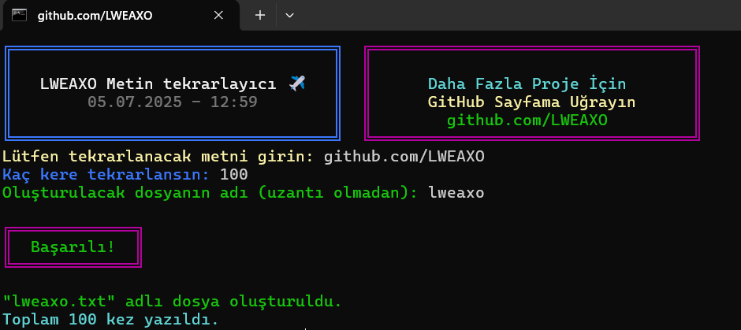

# 💎 LWEAXO Metin Tekrarlayıcı



## 📌 Proje Hakkında

Bu Node.js tabanlı araç, kullanıcıların belirledikleri bir metni istedikleri kadar tekrar ederek bir çıktı dosyası oluşturmalarını sağlar. Özellikle test verisi oluşturma, demo içerik hazırlama veya tekrarlı metinler gerektiren durumlar için idealdir.

## ✨ Öne Çıkan Özellikler

- **Renkli ve şık konsol arayüzü**
- **Otomatik dosya adı temizleme** (geçersiz karakterleri düzeltir)
- **Hata yönetimi** (dosya oluşturulamazsa alternatif isim denemesi)
- **Tarih ve saat bilgisi** (işlem zamanını kaydeder)
- **Responsive tasarım** (konsol boyutuna uyum sağlar)

## 🛠 Kurulum

1. Node.js'in yüklü olduğundan emin olun (v14 veya üzeri)
2. Proje dizininde terminal açın ve şu komutu çalıştırın:
   ```bash
   npm install colors
   ```
3. Script'i çalıştırın:
   ```bash
   node index.js
   ```

## 🖥 Kullanım Örnekleri

### Temel Kullanım
```bash
Lütfen tekrarlanacak metni girin: Merhaba Dünya
Kaç kere tekrarlansın: 5
Oluşturulacak dosyanın adı (uzantı olmadan): deneme
```

### Özel Karakterler İçeren Dosya Adı
```bash
Lütfen tekrarlanacak metni girin: Test
Kaç kere tekrarlansın: 3
Oluşturulacak dosyanın adı (uzantı olmadan): "deneme/1"

# Çıktı: "Dosya adındaki geçersiz karakterler düzeltildi:"
# Orijinal istek: "deneme/1.txt"
# Düzeltilmiş ad: deneme_1.txt
```

### Büyük Ölçekli Tekrar
```bash
Lütfen tekrarlanacak metni girin: lweaxo can
Kaç kere tekrarlansın: 10000
Oluşturulacak dosyanın adı (uzantı olmadan): lweaxo_can
```

## 📂 Kullanım Senaryoları

1. **Test Verisi Oluşturma**  
   Yazılım testleri için büyük miktarda veriye ihtiyaç duyduğunuzda kullanabilirsiniz.

2. **Demo İçerik Hazırlama**  
   Web siteniz için placeholder içerikler oluşturabilirsiniz.

3. **Performans Testleri**  
   Büyük metin dosyalarıyla çalışan uygulamaların performansını test edebilirsiniz.

4. **Eğitim Materyalleri**  
   Tekrar egzersizleri için örnek metinler oluşturabilirsiniz.

## 🔍 Kod Analizi

### Ana Fonksiyonlar
- **`temizleDosyaAdi(adi)`**  
  Dosya adındaki geçersiz karakterleri temizler ve uygun formata getirir.

- **`sayiSoru(soru, callback)`**  
  Kullanıcıdan sayısal girdi almak için özel bir fonksiyon.

- **`printDoubleBox()`**  
  Konsola renkli ve estetik bir başlık kutusu yazdırır.

### Önemli Özellikler
- Dosya adı 255 karakterle sınırlıdır
- Arka arkaya gelen alt çizgiler tekilleştirilir
- Noktalarla başlayan veya biten dosya adları düzeltilir

## 🚀 Geliştirme

Projeyi geliştirmek için:

1. Repoyu forklayın
2. Yeni branch oluşturun (`git checkout -b feature/yeni-ozellik`)
3. Değişiklikleri commit edin (`git commit -am 'Yeni özellik eklendi'`)
4. Branch'i pushlayın (`git push origin feature/yeni-ozellik`)
5. Pull request açın

## 📜 Lisans

Bu proje [MIT](LICENSE) lisansı altında yayınlanmıştır. Daha fazla bilgi için `LICENSE` dosyasını inceleyin.

---

**👨‍💻 Developer:** [LWEAXO](https://github.com/LWEAXO)  
<div align="center">
  <a href="https://github.com/LWEAXO">
    
  </a>
  <a href="https://discord.gg/h7YAermnyw">
    
  </a>
</div>

---